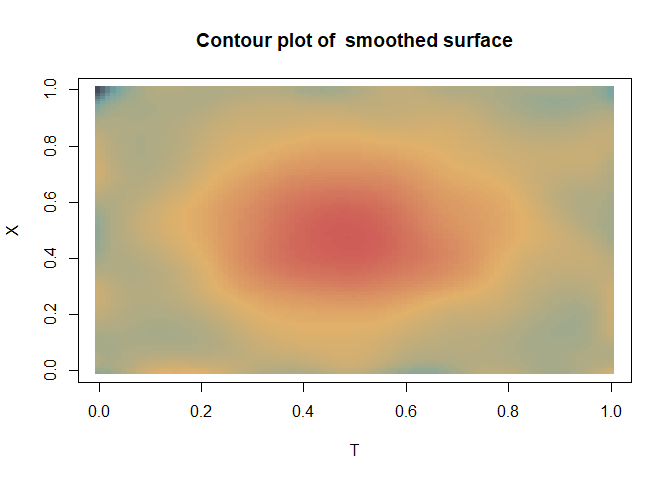

<!-- README.md is generated from README.Rmd. Please edit that file -->

# DCSmooth

<!-- badges: start -->
<!-- badges: end -->

## Overview

DCSmooth provides functions for fast nonparametric estimation of the
trend surface of a functional or spatial model. Regression types
included are kernel regression and local polynomial regression. An
automatic bandwidth selector is included.

## Installation

You can install the released version of DCSmooth from
[CRAN](https://CRAN.R-project.org) with:

``` r
install.packages("DCSmooth")
```

    ## Example

    This basic example shows the two-dimensional estimation of a single gaussian peak
    function (in `y.norm1`).


    ```r
    library(DCSmooth)

    # simulated data
    y = y.norm1 + matrix(rnorm(101^2), nrow = 101, ncol = 101)

    # smooth trend surface
    y_dcs = dcs(y)
    plot(y_dcs, plot_choice = 2)



``` r
# surface.dcs(y_dcs, plot_choice = 2)
```

## Details

For a detailed description, see the vignette of this package.

``` r
vignette("DCSmooth")
```
